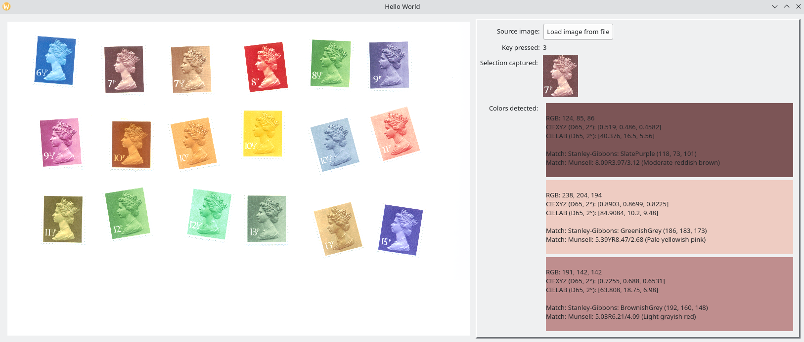

# ColorIdentification

## Color identification software with GUI

In folder `color_detect_gui`.

Dependencies: PyQt5, numpy, pandas, opencv2, sklearn, colour (package `colour-science`)

Workflow:
* Set ICC profile of scanner in `config.ini` by changing the value of `fileNameInputProfile`
* Open GUI: `./main.py` (you might have to change the shebang to your system/environment and/or `chmod +x main.py`)
* Load an image file by clicking the (only) button. A file-open dialog will show
* Select a portion of the image by drawing a rectangle over it. No visual is displayed - it looks like nothing is happening, but it is! Just select a rectangle and it will show up in the right panel :)
* Hit a number key (2 to 9) and that amount of colors will be detected in the selection. Color matches will be shown in the list below the selection

## Stanley Gibbons color key

In folder `color_key`.

With generating code (Jupyter Notebook) and example output file (CSV).
