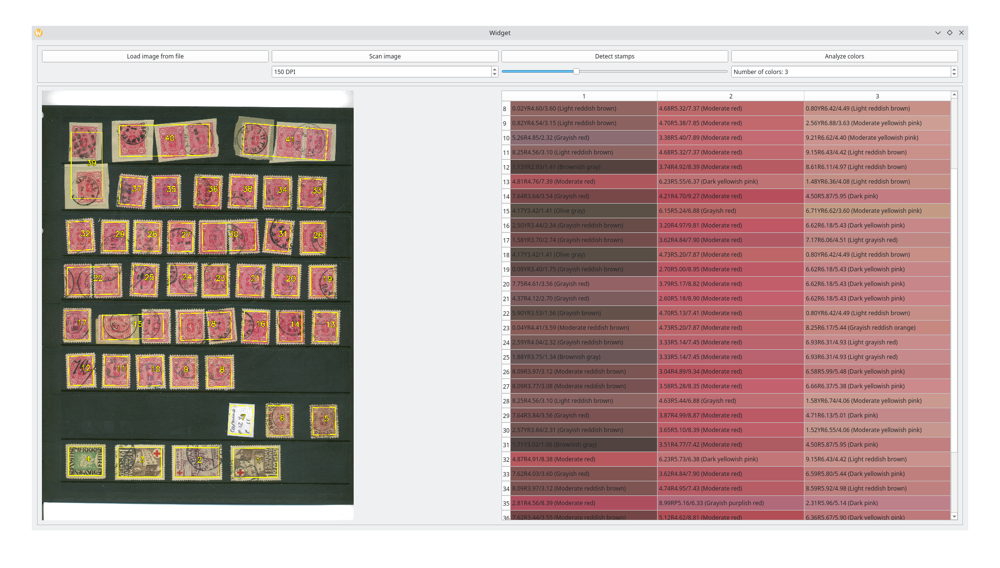

# ColorIdentification

## Color identification software with GUI

In folder `color_detect_gui`.

Dependencies: PySide6, numpy, pandas, opencv2, sklearn, pillow, sane, colour (package `colour-science`)

Workflow:
* Set ICC profile of scanner in `config.ini` by changing the value of `fileNameInputProfile`
* Open GUI: `./main.py` (you might have to change the shebang to your system/environment and/or `chmod +x main.py`)
* Load or scan an image (currently only supports scanning in Linux using SANE)
* Detect stamps automatically; adjust the threshold slider to change the algorithm sensitivity (more controls coming soon)
* For each detected stamp, determine the color by hitting the Analyze Color button

Future ideas:
* Plotting of all colors on a chart, if I can find a nice 2D visualization
* More fine-grained controls for scanning, stamp detection and color detection

## Stanley Gibbons color key

In folder `color_key`.

With generating code (Jupyter Notebook) and example output file (CSV).
